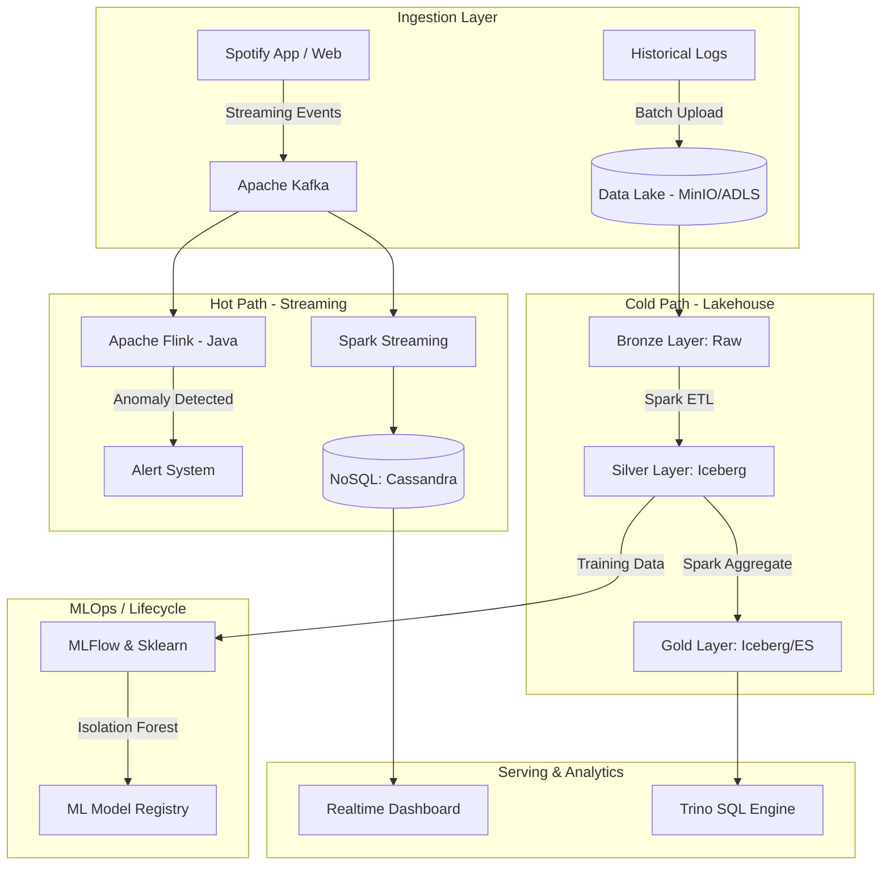

# 🎵 Spotify Behavior Data Platform & ML-Ops Hybrid Architecture

---

## 📖 Giới thiệu

Dự án Big Data xử lý dữ liệu hành vi âm nhạc Spotify theo kiến trúc **Lakehouse** và **Streaming Real-time** hiện đại. 
Dự án được triển khai trên nền tảng Cloud-native Kubernetes Platform, tích hợp ML-Ops & Data Cloud phù hợp với các tiêu chuẩn quy mô Enterprise.

---

## 🎯 Điểm nhấn Kỹ thuật (Key Features)

* **Kubernetes Data Platform**: Triển khai ecosystem (Spark, Kafka, MinIO/Azure DL) trên Kubernetes (AKS).
* **Lakehouse Architecture**: Xây dựng kiến trúc Medallion (Bronze - Silver - Gold) với **Apache Iceberg**, đảm bảo tính toàn vẹn (ACID Transactions).
* **High-Throughput ETL (Batch)**: Apache Spark + PySpark thực hiện làm sạch dữ liệu lớn hằng ngày. 
* **Ultra Low-Latency Streaming**: Tích hợp luồng event (nghe nhạc, skip bài) với **Kafka** và **Apache Flink (Java)** nhằm bắt các tương tác bất thường realtime.
* **Serving Database Mix**: Cung cấp **Trino** làm SQL Query Engine và **Cassandra** cho NoSQL Dashboard response <10ms.
* **MLOps**: Kết hợp thư viện **MLflow** vào quá trình training Pipeline để huấn luyện mô hình học máy (Isolation Forest) phát hiện dị thường.
* **Infrastructure as Code (Azure)**: Quản lý hạ tầng đám mây Azure thông qua Terraform (`azure_iac`). 

---

## 🏗️ Kiến trúc hệ thống (High-Level Architecture)

---

## 📁 Cấu trúc Thư mục

* `/spark_jobs`: Code ETL Batch/Streaming với PySpark và Iceberg.
* `/flink_jobs`: Project Java Flink handle Realtime Anomaly Detection.
* `/kubernetes`: K8s Manifests hạ tầng.
* `/mlops`: Pipeline machine learning train model.
* `/azure_iac`: Terraform script chạy Azure Cloud.
* `/docs`: Tài liệu chuẩn bị phỏng vấn, kiến trúc và concept.

*(📝 Xem giải thích kỹ thuật và các quyết định kiến trúc tại `/docs/INTERVIEW_DOCUMENTATION.md`)*

---

## ⚙️ Cấu hình (Environment Variables)

Các job đọc cấu hình từ biến môi trường để không phụ thuộc vào máy cụ thể. Các biến sau được thêm/chuẩn hoá gần đây:

| Biến | Mặc định | Dùng bởi | Mô tả |
| :--- | :--- | :--- | :--- |
| `INGEST_DATE` | `2025-12-21` | `spark_jobs/batch/bronze_to_silver_all.py`, `silver_to_gold_all.py` | Ngày partition dữ liệu cần xử lý. Airflow có thể truyền `{{ ds }}`. |
| `TRACKS_DATA_PATH` | `<repo>/data/tracks.json` | `spark_jobs/stream/produce_to_kafka.py` | Đường dẫn file track cho producer (mặc định trỏ vào repo, portable). |

*(Chi tiết thay đổi theo từng PR: xem `/docs/CHANGELOG.md`.)*
