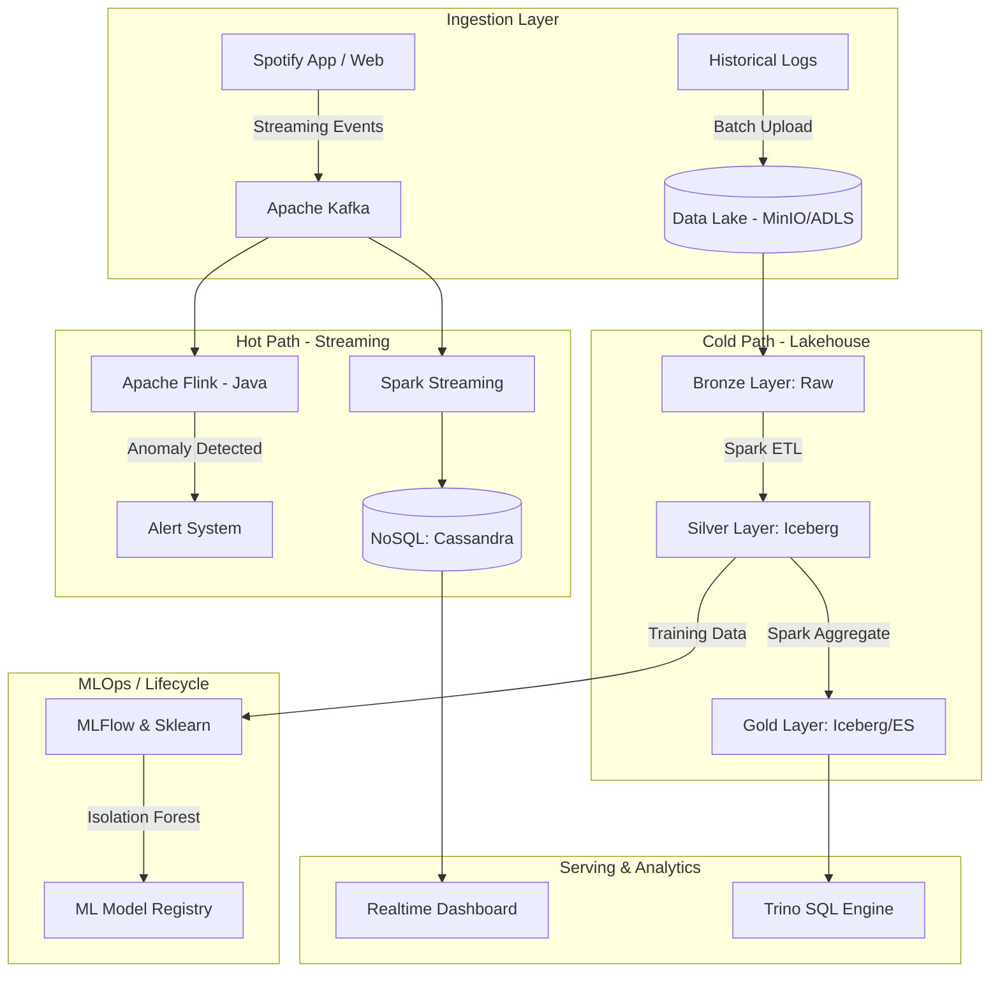
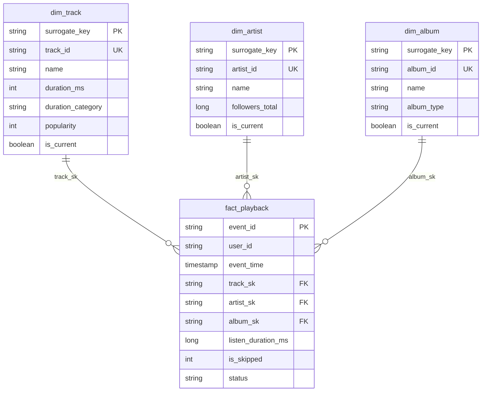

# 🎵 Spotify Behavior Data Platform & ML-Ops Hybrid Architecture


---

## 📖 Overview

A big-data project that processes Spotify music-listening behaviour on a modern
**Lakehouse** + **real-time streaming** architecture. It runs on a cloud-native
Kubernetes platform and integrates MLOps and a data-cloud footprint at
enterprise-grade standards.

---

## 🎯 Key Features

* **Kubernetes Data Platform**: the whole ecosystem (Spark, Kafka, MinIO/Azure Data Lake) deployed on Kubernetes (AKS).
* **Lakehouse Architecture**: a Medallion architecture (Bronze → Silver → Gold) on **Apache Iceberg** with ACID transactions.
* **High-Throughput Batch ETL**: Apache Spark + PySpark for daily large-scale cleaning and modelling.
* **Ultra Low-Latency Streaming**: listen/skip events through **Kafka** and **Apache Flink (Java)** to catch anomalous interactions in real time.
* **Mixed Serving Databases**: **Trino** as the SQL query engine and **Cassandra** as the NoSQL store for sub-10ms dashboard responses.
* **MLOps**: **MLflow** wired into the training pipeline to train an anomaly-detection model (Isolation Forest).
* **Infrastructure as Code (Azure)**: the Azure cloud footprint is managed with Terraform (`azure_iac`).

---

## 🏗️ High-Level Architecture



> ℹ️ The diagram above is the **target architecture**. The real status of each
> component (already built vs. still roadmap) is listed honestly below.

---

## ✅ Implemented vs Roadmap

Every claim in these docs maps to merged code or is clearly labelled roadmap.
Per-PR detail: `docs/CHANGELOG.md`.

### ✅ Implemented (merged into `main`)

| Component | Evidence |
| :--- | :--- |
| Central config + topic taxonomy | `common/config.py` |
| Streaming Kafka → Cassandra & Elasticsearch, durable checkpoints | `spark_jobs/stream/*` (PR-04) |
| Flink **stateful** windowed anomaly detection → Kafka `TOPIC_ANOMALY` | `flink_jobs/` (PR-05, PR-10) |
| Fail-fast credentials (`require_env`) | `common/config.py` (PR-06) |
| **Iceberg** Lakehouse Silver + Gold + maintenance (compaction/expiry) | `spark_jobs/batch/*`, `common/spark.py` (PR-07/08) |
| **Star schema** + SCD2 dims + `fact_playback` | `spark_jobs/batch/build_*`, `common/modeling.py` (PR-09) |
| Airflow batch DAG submitting Spark on K8s (idempotent, backfillable) | `dags/spotify_batch_pipeline.py` (PR-11/12) |
| Structured JSON logging + fail-loud jobs | `common/logging.py` (PR-13) |
| CI (lint · secret scan · conflict guard · pytest · Flink build) | `.github/workflows/ci.yml` (PR-14) |
| Data-quality gates between layers | `spark_jobs/quality/checks.py` (PR-15) |
| **MLOps**: feature table → Isolation Forest → MLflow registry | `spark_jobs/batch/build_features.py`, `mlops/` (PR-16) |
| Kustomize `base/`+`overlays/` deploy, pinned Helm values | `kubernetes/` (PR-17) |
| Cost/perf: native expr replacing the UDF, AQE, Iceberg file-sizing | `spark_jobs/batch/bronze_to_silver_all.py` (PR-18) |
| DR/scaling runbook + object versioning + replicated storage | `docs/DR_AND_SCALING.md`, `azure_iac/` (PR-19) |

### 🗺️ Roadmap (not built yet / scaffolding only)

| Component | Status |
| :--- | :--- |
| **Trino** SQL engine (serving on Gold) | Target — no manifest/job yet. |
| **Realtime dashboard** | Streamlit scaffold (`dashboard_app.py`), serving not fully wired. |
| **Alert system** for anomalies | Flink emits to `TOPIC_ANOMALY`; the downstream **alerting consumer** does not exist yet. |
| Raw events → Bronze/Silver `events` | `fact_playback` currently reads Cassandra (the serving store); landing raw events into the lake is a follow-up (`FACT_SOURCE` makes the swap config-only). |
| Silver/Gold format cutover | Iceberg is behind a feature flag (`SILVER_FORMAT`/`GOLD_FORMAT`, default `parquet`) — the legacy Parquet path stays until the cutover PR. |

---

## 🗃️ Data Model — Star Schema (ERD)

The fact grain is **one row per playback event** (`event_id`); dimensions are
SCD2 (surrogate key + `attr_hash` + `valid_from`/`valid_to`/`is_current`).
Full detail: `docs/DATA_MODEL.md`.

Legend: `PK` = surrogate key · `UK` = business/natural key · `FK` → dim surrogate
key · dims carry SCD2 columns (`attr_hash`, `valid_from`, `valid_to`, `is_current`).



---

## 🚀 Quickstart

**1. Test locally (no cluster needed):**
```bash
pip install -r requirements-dev.txt
pytest                     # unit tests; Spark/Airflow/MinIO tests self-skip
ruff check .               # lint
```

**2. Configure secrets (never commit them):**
```bash
cp ingestion/producer/.env.example ingestion/producer/.env
cp ingestion/consumer/.env.example ingestion/consumer/.env
# fill in SPOTIFY_CLIENT_ID/SECRET, MINIO_ACCESS_KEY/SECRET_KEY (see docs/SECRETS.md)
```

**3. Deploy infrastructure (Kustomize, renders offline):**
```bash
kubectl kustomize kubernetes/overlays/dev     # preview
kubectl apply   -k kubernetes/overlays/dev    # or overlays/prod
```
Install Airflow + Spark Operator with Helm — see `kubernetes/README.md`.

**4. Run the batch ETL** (trigger the Airflow `spotify_batch_pipeline` DAG, or locally):
```bash
INGEST_DATE=2025-12-21 SILVER_FORMAT=iceberg \
  spark-submit spark_jobs/batch/bronze_to_silver_all.py
```

**5. MLOps loop** — build features, then train + register the model:
```bash
spark-submit spark_jobs/batch/build_features.py
python mlops/train_anomaly_model.py           # see docs/MLOPS.md
```

### 📚 Documentation
`docs/DATA_MODEL.md` · `docs/lakehouse.md` · `docs/streaming.md` ·
`docs/orchestration.md` · `docs/DATA_QUALITY.md` · `docs/MLOPS.md` ·
`docs/DR_AND_SCALING.md` · `docs/CONFIGURATION.md` · `docs/SECRETS.md` ·
`docs/ci.md` · `docs/INTERVIEW_DOCUMENTATION.md` · `docs/CHANGELOG.md`

---

## 📁 Directory Structure

* `/spark_jobs`: Batch/streaming ETL code in PySpark + Iceberg.
* `/flink_jobs`: The Java Flink project for real-time anomaly detection.
* `/kubernetes`: Infrastructure K8s manifests.
* `/mlops`: The machine-learning training pipeline.
* `/azure_iac`: Terraform for the Azure cloud footprint.
* `/docs`: Interview-prep, architecture, and concept documentation.

*(📝 Technical explanations and architecture decisions live in `/docs/INTERVIEW_DOCUMENTATION.md`.)*

---

## ⚙️ Configuration (Environment Variables)

Jobs read their configuration from environment variables so they don't depend on
a specific machine. Recently added / standardised variables:

| Variable | Default | Used by | Description |
| :--- | :--- | :--- | :--- |
| `INGEST_DATE` | `2025-12-21` | `spark_jobs/batch/bronze_to_silver_all.py`, `silver_to_gold_all.py` | Partition date of the data to process. Airflow can pass `{{ ds }}`. |
| `TRACKS_DATA_PATH` | `<repo>/data/tracks.json` | `spark_jobs/stream/produce_to_kafka.py` | Track file path for the producer (defaults into the repo, portable). |
| `TOPIC_PLAYBACK` | `spotify_playback_events` | Producer + stream jobs (`common/config.py`) | Unified topic name for the listening-event stream. |
| `MINIO_ACCESS_KEY` / `MINIO_SECRET_KEY` | *(required)* | Jobs that read/write MinIO | Required — the job fails fast if unset instead of falling back to an insecure default. |
| `DATA_DIR` | `<repo>/data` | `minIO/*.py`, some batch jobs | Local data directory (replacing hardcoded `D:\...` paths). |

*(Central configuration source: `common/config.py` — see `/docs/CONFIGURATION.md`. Per-PR change detail: see `/docs/CHANGELOG.md`.)*
