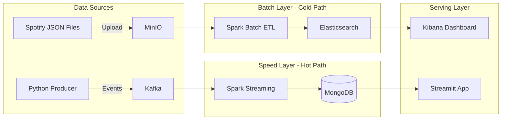

# 🎵 Spotify Big Data Hybrid Platform  
## Batch: Elasticsearch + Kibana | Stream: MongoDB + Streamlit


---

## 📖 Giới thiệu

Dự án Big Data xử lý dữ liệu âm nhạc Spotify theo kiến trúc  
**Lambda Architecture (Hybrid)**.

Hệ thống tách biệt công nghệ hiển thị để tối ưu tài nguyên:
- **Kibana** cho phân tích dữ liệu lịch sử (Batch)
- **Streamlit** cho giám sát dữ liệu thời gian thực (Streaming)

---

## 🎯 Mục tiêu dự án

- Lưu trữ dữ liệu thô trên **MinIO (Data Lake)**
- Xử lý **Batch ETL** bằng **Apache Spark**
- Đồng bộ dữ liệu phân tích sang **Elasticsearch**
- Xử lý **Streaming Real-time** với **Kafka + Spark Streaming**
- Lưu dữ liệu streaming vào **MongoDB**
- Trực quan hóa:
  - Batch: **Kibana**
  - Stream: **Streamlit Dashboard**

---

## 🏗️ Kiến trúc hệ thống (Hybrid Lambda Architecture)



---

## 🛠️ Prerequisites

| Công cụ | Phiên bản |
|------|---------|
| Docker Desktop | Latest |
| Minikube | v1.30+ |
| Helm | v3+ |
| Python | 3.8+ |

---

## 🚀 Phần 1: Khởi động Hạ tầng

### 1. Start Minikube
Yêu cầu RAM cao để chạy đồng thời ELK và MongoDB.

```powershell
minikube start --memory 7168 --cpus 4
```

---

### 2. Deploy các dịch vụ nền tảng

```powershell
# Namespace
kubectl apply -f kubernetes/namespace.yaml

# Messaging & Storage
kubectl apply -f kubernetes/minio.yaml
kubectl apply -f kubernetes/kafka.yaml

# Serving Databases
kubectl apply -f kubernetes/elk.yaml
kubectl apply -f kubernetes/mongodb.yaml
```

---

### 3. Cài Spark Operator

```powershell
helm repo add spark-operator https://kubeflow.github.io/spark-operator
helm repo update

helm install spark-operator spark-operator/spark-operator `
  --namespace bigdata `
  --set webhook.enable=false `
  --set sparkJobNamespace=""
```

---

### 4. Build & Push Docker Image
Thay `your_dockerhub` bằng Docker Hub username của bạn.

```powershell
docker login
docker build -t your_dockerhub/spotify-spark-jobs:v1 .
docker push your_dockerhub/spotify-spark-jobs:v1
```

---

## 🔌 Phần 2: Port Forwarding (BẮT BUỘC)

Mở **4 terminal PowerShell riêng biệt** và giữ nguyên trong lúc demo.

```powershell
# MinIO
kubectl port-forward svc/minio -n bigdata 9000:9000

# Kafka
kubectl port-forward svc/kafka -n bigdata 9092:9092

# MongoDB
kubectl port-forward svc/mongodb -n bigdata 27017:27017

# Kibana
kubectl port-forward svc/kibana -n bigdata 5601:5601
```

---

## 🎬 Phần 3: Kịch bản Demo

### 🅰️ Demo Batch Processing (Elasticsearch + Kibana)

```powershell
python upload_to_bronze.py

kubectl apply -f spark_jobs/batch/yaml/run_bronze_to_silver.yaml
kubectl apply -f spark_jobs/batch/yaml/run_silver_to_gold.yaml
kubectl apply -f spark_jobs/batch/yaml/run_gold_to_es.yaml
```

Truy cập Kibana: http://localhost:5601  
Index Pattern: `batch_artists*`

---

### 🅱️ Demo Stream Processing (MongoDB + Streamlit)

```powershell
kubectl apply -f spark_jobs/stream/run_stream_mongo.yaml
kubectl get pods -n bigdata -w
```

Bắn dữ liệu giả lập:
```powershell
python spark_jobs/stream/produce_to_kafka.py
```

Chạy dashboard:
```powershell
streamlit run dashboard_app.py
```

---

## ❓ Troubleshooting

| Lỗi | Nguyên nhân | Cách khắc phục |
|---|---|---|
| Waiting for data... | Producer chưa chạy | Kiểm tra producer & Mongo collection |
| Kibana trống | Batch chưa sync | Chạy lại job gold-to-es |
| TLS handshake timeout | Thiếu RAM | Tăng RAM Minikube > 7GB |
| CrashLoopBackOff | Thiếu quyền | Cấp cluster-admin cho Operator |

---

