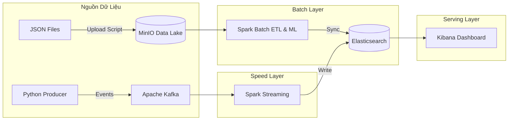

# 🎵 Spotify Big Data Analytics Platform (Lambda Architecture)

Dự án **Big Data phân tích dữ liệu Spotify** được xây dựng theo kiến trúc **Lambda Architecture**, triển khai trên **Kubernetes (Minikube)**. Hệ thống kết hợp **Batch Processing** (xử lý dữ liệu lịch sử + ML) và **Stream Processing** (xử lý thời gian thực), phục vụ phân tích và trực quan hóa dữ liệu âm nhạc.

---

## 📌 Mục tiêu dự án

* Xây dựng **Data Lake** trên MinIO (S3-compatible)
* Xử lý dữ liệu batch bằng **Apache Spark + Spark Operator**
* Xử lý dữ liệu realtime bằng **Kafka + Spark Streaming**
* Đồng bộ dữ liệu sang **Elasticsearch**
* Trực quan hóa bằng **Kibana Dashboard**
* Triển khai toàn bộ trên **Kubernetes (Minikube)**

---

## 🏗️ Kiến trúc hệ thống



---

## 🛠️ Yêu cầu tiên quyết (Prerequisites)

Đảm bảo máy đã cài đặt:

* **Docker Desktop** (đang chạy)
* **Minikube**
* **kubectl**
* **Helm**
* **Python 3.x**

  * Thư viện: `kafka-python`, `minio`

---

## 🚀 Phần 1: Khởi động hạ tầng (Infrastructure Setup)

### 1️⃣ Khởi động Minikube

```powershell
minikube start --memory 6144 --cpus 4
```

> 🔔 Khuyến nghị: RAM ≥ **6GB** để chạy ổn định ELK Stack

---

### 2️⃣ Cài đặt các dịch vụ nền tảng

```powershell
# Tạo namespace
minikube kubectl -- apply -f kubernetes/namespace.yaml

# Cài đặt MinIO, Kafka, ELK Stack
minikube kubectl -- apply -f kubernetes/minio.yaml
minikube kubectl -- apply -f kubernetes/kafka.yaml
minikube kubectl -- apply -f kubernetes/elk.yaml
```

---

### 3️⃣ Cài đặt Spark Operator

```powershell
helm repo add spark-operator https://kubeflow.github.io/spark-operator
helm repo update

helm install my-release spark-operator/spark-operator \
  --namespace bigdata \
  --set webhook.enable=false \
  --set sparkJobNamespace=""
```

👉 Spark Operator chịu trách nhiệm quản lý tài nguyên `SparkApplication` trong Kubernetes.

---

### 4️⃣ Build & Push Docker Image Spark

```powershell
docker login
docker build -t k67ithust/spotify-spark-jobs:v1 .
docker push k67ithust/spotify-spark-jobs:v1
```

> ⚠️ Thay `k67ithust` bằng Docker Hub username của bạn nếu khác.

---

## 🔌 Phần 2: Port Forwarding (BẮT BUỘC)

⚠️ **Mở 3 tab PowerShell riêng biệt và giữ chạy liên tục trong lúc demo**

### 🔹 Tab 1 – MinIO (Data Lake)

```powershell
minikube kubectl -- port-forward svc/minio -n bigdata 9000:9000
```

* Web UI: [http://localhost:9001](http://localhost:9001) (nếu mở thêm port 9001)

---

### 🔹 Tab 2 – Kafka

```powershell
minikube kubectl -- port-forward svc/kafka -n bigdata 9092:9092
```

---

### 🔹 Tab 3 – Kibana

```powershell
minikube kubectl -- port-forward svc/kibana -n bigdata 5601:5601
```

* Truy cập: [http://localhost:5601](http://localhost:5601)

---

## 🎬 Phần 3: Kịch bản Demo

---

### 🅰️ Batch Processing (Xử lý lịch sử)

#### Bước 1: Ingestion – Upload dữ liệu thô

```powershell
python upload_to_bronze.py
```

---

#### Bước 2: Chạy Spark Batch Jobs

```powershell
# Bronze → Silver (Làm sạch)
minikube kubectl -- delete sparkapplication batch-bronze-to-silver -n bigdata
minikube kubectl -- apply -f spark_jobs/batch/yaml/run_bronze_to_silver.yaml

# Silver → Gold (Analytics)
minikube kubectl -- delete sparkapplication batch-silver-to-gold -n bigdata
minikube kubectl -- apply -f spark_jobs/batch/yaml/run_silver_to_gold.yaml

# Machine Learning – KMeans Clustering
minikube kubectl -- delete sparkapplication batch-ml-clustering -n bigdata
minikube kubectl -- apply -f spark_jobs/batch/yaml/run_ml_clustering.yaml
```

---

#### Bước 3: Đồng bộ dữ liệu sang Elasticsearch

```powershell
minikube kubectl -- delete sparkapplication batch-gold-to-es -n bigdata
minikube kubectl -- apply -f spark_jobs/batch/yaml/run_gold_to_es.yaml
```

---

### 🅱️ Stream Processing (Thời gian thực)

#### Bước 1: Chạy Spark Streaming Job

```powershell
minikube kubectl -- delete sparkapplication spotify-streaming-job -n bigdata
minikube kubectl -- apply -f spark_jobs/stream/run_stream_job.yaml
```

Theo dõi pod:

```powershell
minikube kubectl -- get pods -n bigdata -w
```

---

#### Bước 2: Bắn dữ liệu giả lập vào Kafka

```powershell
python spark_jobs/stream/produce_to_kafka.py
```

Bạn sẽ thấy log kiểu:

```
User X listened to track Y
```

---

## 📊 Phần 4: Trực quan hóa (Visualization)

1. Truy cập **Kibana**: [http://localhost:5601](http://localhost:5601)
2. Vào **Stack Management → Index Patterns**
3. Tạo Index Pattern:

   * Batch: `batch_artists*`
   * Stream: `realtime_events*`

     * Time field: `processed_timestamp`
4. Vào **Dashboard** để xem dữ liệu realtime & batch

---

## ❓ Troubleshooting

| Lỗi                             | Nguyên nhân         | Cách khắc phục                      |
| ------------------------------- | ------------------- | ----------------------------------- |
| Connection Refused              | Chưa port-forward   | Kiểm tra lại các tab PowerShell     |
| TLS Handshake Timeout           | Thiếu RAM/CPU       | Restart Minikube với RAM lớn hơn    |
| CrashLoopBackOff (Spark)        | Lỗi quyền namespace | Xóa pod operator để restart         |
| No FileSystem for scheme s3a    | Thiếu dependency    | Kiểm tra `hadoop-aws` & `aws-sdk`   |
| Permission Denied (/home/spark) | Ivy cache lỗi       | Đảm bảo `spark.jars.ivy=/tmp/.ivy2` |

---

## ✅ Kết luận

Dự án mô phỏng **hệ thống Big Data production** với:

* Kubernetes
* Spark Operator
* MinIO (S3)
* Kafka
* Elasticsearch + Kibana

Phù hợp cho:

* Đồ án Big Data
* Demo CV / Portfolio
* Học Kubernetes + Spark thực tế

🎉 **Chúc bạn demo thành công!**
