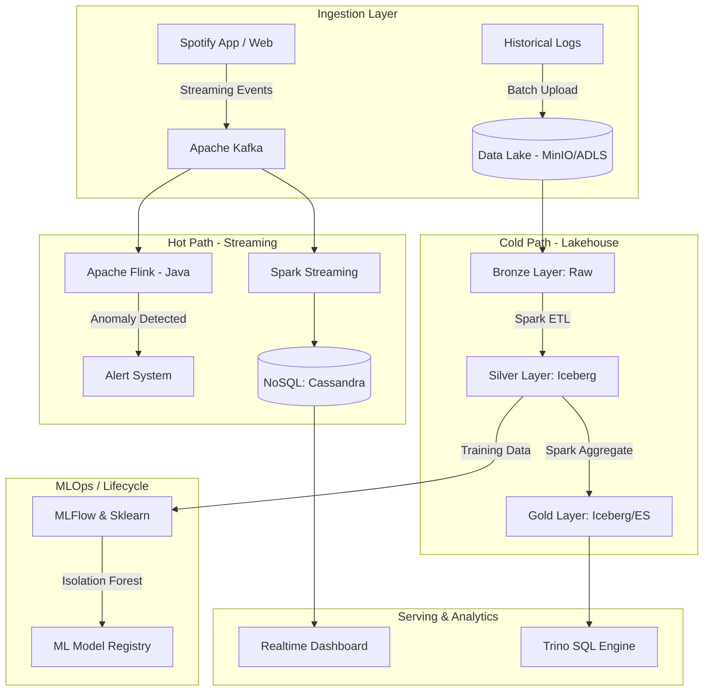

# 🎵 Spotify Behavior Data Platform & ML-Ops Hybrid Architecture


---

## 📖 Giới thiệu

Dự án Big Data xử lý dữ liệu hành vi âm nhạc Spotify theo kiến trúc **Lakehouse** và **Streaming Real-time** hiện đại. 
Dự án được triển khai trên nền tảng Cloud-native Kubernetes Platform, tích hợp ML-Ops & Data Cloud phù hợp với các tiêu chuẩn quy mô Enterprise.

---

## 🎯 Điểm nhấn Kỹ thuật (Key Features)

* **Kubernetes Data Platform**: Triển khai ecosystem (Spark, Kafka, MinIO/Azure DL) trên Kubernetes (AKS).
* **Lakehouse Architecture**: Xây dựng kiến trúc Medallion (Bronze - Silver - Gold) với **Apache Iceberg**, đảm bảo tính toàn vẹn (ACID Transactions).
* **High-Throughput ETL (Batch)**: Apache Spark + PySpark thực hiện làm sạch dữ liệu lớn hằng ngày. 
* **Ultra Low-Latency Streaming**: Tích hợp luồng event (nghe nhạc, skip bài) với **Kafka** và **Apache Flink (Java)** nhằm bắt các tương tác bất thường realtime.
* **Serving Database Mix**: Cung cấp **Trino** làm SQL Query Engine và **Cassandra** cho NoSQL Dashboard response <10ms.
* **MLOps**: Kết hợp thư viện **MLflow** vào quá trình training Pipeline để huấn luyện mô hình học máy (Isolation Forest) phát hiện dị thường.
* **Infrastructure as Code (Azure)**: Quản lý hạ tầng đám mây Azure thông qua Terraform (`azure_iac`). 

---

## 🏗️ Kiến trúc hệ thống (High-Level Architecture)



> ℹ️ Sơ đồ trên là **kiến trúc mục tiêu**. Trạng thái thực tế của từng thành phần
> (đã build vs còn là roadmap) được liệt kê trung thực ngay dưới đây.

---

## ✅ Trạng thái triển khai (Implemented vs Roadmap)

Mọi tuyên bố trong tài liệu này ánh xạ tới code đã merge, hoặc được gắn nhãn
roadmap rõ ràng. Chi tiết theo từng PR: `docs/CHANGELOG.md`.

### ✅ Đã triển khai (merged vào `main`)

| Thành phần | Bằng chứng |
| :--- | :--- |
| Central config + topic taxonomy | `common/config.py` |
| Streaming Kafka → Cassandra & Elasticsearch, checkpoint bền vững | `spark_jobs/stream/*` (PR-04) |
| Flink **stateful** windowed anomaly detection → Kafka `TOPIC_ANOMALY` | `flink_jobs/` (PR-05, PR-10) |
| Fail-fast credentials (`require_env`) | `common/config.py` (PR-06) |
| **Iceberg** Lakehouse Silver + Gold + maintenance (compaction/expiry) | `spark_jobs/batch/*`, `common/spark.py` (PR-07/08) |
| **Star schema** + SCD2 dims + `fact_playback` | `spark_jobs/batch/build_*`, `common/modeling.py` (PR-09) |
| Airflow batch DAG submitting Spark trên K8s (idempotent, backfillable) | `dags/spotify_batch_pipeline.py` (PR-11/12) |
| Structured JSON logging + fail-loud jobs | `common/logging.py` (PR-13) |
| CI (lint · secret scan · conflict guard · pytest · Flink build) | `.github/workflows/ci.yml` (PR-14) |
| Data-quality gates giữa các layer | `spark_jobs/quality/checks.py` (PR-15) |
| **MLOps**: feature table → Isolation Forest → MLflow registry | `spark_jobs/batch/build_features.py`, `mlops/` (PR-16) |
| Kustomize `base/`+`overlays/` deploy, Helm values pinned | `kubernetes/` (PR-17) |
| Cost/perf: native expr thay UDF, AQE, Iceberg file-sizing | `spark_jobs/batch/bronze_to_silver_all.py` (PR-18) |
| DR/scaling runbook + object versioning + replicated storage | `docs/DR_AND_SCALING.md`, `azure_iac/` (PR-19) |

### 🗺️ Roadmap (chưa build / mới ở mức khung)

| Thành phần | Trạng thái |
| :--- | :--- |
| **Trino** SQL engine (serving trên Gold) | Mục tiêu — chưa có manifest/job. |
| **Realtime dashboard** | Khung Streamlit (`dashboard_app.py`), chưa nối serving hoàn chỉnh. |
| **Alert system** cho anomaly | Flink phát ra `TOPIC_ANOMALY`; **consumer cảnh báo** downstream chưa có. |
| Raw events → Bronze/Silver `events` | `fact_playback` hiện đọc Cassandra (serving store); landing raw vào lake là follow-up (`FACT_SOURCE` cho phép đổi bằng config). |
| Silver/Gold format cutover | Iceberg đang sau feature-flag (`SILVER_FORMAT`/`GOLD_FORMAT`, mặc định `parquet`) — đường Parquet cũ giữ tới PR cutover. |

---

## 🗃️ Mô hình dữ liệu — Star Schema (ERD)

Grain của fact là **một dòng / một sự kiện nghe nhạc** (`event_id`); dimensions là
SCD2 (surrogate key + `attr_hash` + `valid_from`/`valid_to`/`is_current`). Chi
tiết: `docs/DATA_MODEL.md`.

```mermaid
erDiagram
    dim_track  ||--o{ fact_playback : track_sk
    dim_artist ||--o{ fact_playback : artist_sk
    dim_album  ||--o{ fact_playback : album_sk

    dim_track {
        string surrogate_key PK
        string track_id BK
        string name
        int    duration_ms
        string duration_category
        int    popularity
        bool   is_current "SCD2"
    }
    dim_artist {
        string surrogate_key PK
        string artist_id BK
        string name
        long   followers_total
        bool   is_current "SCD2"
    }
    dim_album {
        string surrogate_key PK
        string album_id BK
        string name
        string album_type
        bool   is_current "SCD2"
    }
    fact_playback {
        string event_id PK "degenerate / MERGE key"
        string user_id
        timestamp event_time
        string track_sk FK
        string artist_sk FK
        string album_sk FK
        long   listen_duration_ms
        int    is_skipped
        string status
    }
```

---

## 🚀 Quickstart

**1. Test cục bộ (không cần cluster):**
```bash
pip install -r requirements-dev.txt
pytest                     # unit tests; test cần Spark/Airflow/MinIO sẽ tự skip
ruff check .               # lint
```

**2. Cấu hình secrets (không commit):**
```bash
cp ingestion/producer/.env.example ingestion/producer/.env
cp ingestion/consumer/.env.example ingestion/consumer/.env
# điền SPOTIFY_CLIENT_ID/SECRET, MINIO_ACCESS_KEY/SECRET_KEY (xem docs/SECRETS.md)
```

**3. Triển khai hạ tầng (Kustomize, render offline được):**
```bash
kubectl kustomize kubernetes/overlays/dev     # xem trước
kubectl apply   -k kubernetes/overlays/dev    # hoặc overlays/prod
```
Cài Airflow + Spark Operator bằng Helm — xem `kubernetes/README.md`.

**4. Chạy batch ETL** (Airflow trigger DAG `spotify_batch_pipeline`, hoặc local):
```bash
INGEST_DATE=2025-12-21 SILVER_FORMAT=iceberg \
  spark-submit spark_jobs/batch/bronze_to_silver_all.py
```

**5. MLOps loop** — build features rồi train + register model:
```bash
spark-submit spark_jobs/batch/build_features.py
python mlops/train_anomaly_model.py           # xem docs/MLOPS.md
```

### 📚 Tài liệu
`docs/DATA_MODEL.md` · `docs/lakehouse.md` · `docs/streaming.md` ·
`docs/orchestration.md` · `docs/DATA_QUALITY.md` · `docs/MLOPS.md` ·
`docs/DR_AND_SCALING.md` · `docs/CONFIGURATION.md` · `docs/SECRETS.md` ·
`docs/ci.md` · `docs/INTERVIEW_DOCUMENTATION.md` · `docs/CHANGELOG.md`

---

## 📁 Cấu trúc Thư mục

* `/spark_jobs`: Code ETL Batch/Streaming với PySpark và Iceberg.
* `/flink_jobs`: Project Java Flink handle Realtime Anomaly Detection.
* `/kubernetes`: K8s Manifests hạ tầng.
* `/mlops`: Pipeline machine learning train model.
* `/azure_iac`: Terraform script chạy Azure Cloud.
* `/docs`: Tài liệu chuẩn bị phỏng vấn, kiến trúc và concept.

*(📝 Xem giải thích kỹ thuật và các quyết định kiến trúc tại `/docs/INTERVIEW_DOCUMENTATION.md`)*

---

## ⚙️ Cấu hình (Environment Variables)

Các job đọc cấu hình từ biến môi trường để không phụ thuộc vào máy cụ thể. Các biến sau được thêm/chuẩn hoá gần đây:

| Biến | Mặc định | Dùng bởi | Mô tả |
| :--- | :--- | :--- | :--- |
| `INGEST_DATE` | `2025-12-21` | `spark_jobs/batch/bronze_to_silver_all.py`, `silver_to_gold_all.py` | Ngày partition dữ liệu cần xử lý. Airflow có thể truyền `{{ ds }}`. |
| `TRACKS_DATA_PATH` | `<repo>/data/tracks.json` | `spark_jobs/stream/produce_to_kafka.py` | Đường dẫn file track cho producer (mặc định trỏ vào repo, portable). |
| `TOPIC_PLAYBACK` | `spotify_playback_events` | Producer + các stream job (`common/config.py`) | Tên topic thống nhất cho luồng sự kiện nghe nhạc. |
| `MINIO_ACCESS_KEY` / `MINIO_SECRET_KEY` | *(bắt buộc)* | Các job đọc/ghi MinIO | Bắt buộc — job dừng ngay (fail-fast) nếu thiếu, không dùng default không an toàn. |
| `DATA_DIR` | `<repo>/data` | `minIO/*.py`, một số batch job | Thư mục dữ liệu local (thay cho đường dẫn `D:\...` cứng). |

*(Nguồn cấu hình tập trung: `common/config.py` — xem `/docs/CONFIGURATION.md`. Chi tiết thay đổi theo từng PR: xem `/docs/CHANGELOG.md`.)*
